# Distributed Data Processing Project

## Description

This project focused on the basics of distributed data processing to gain an understanding of the concepts and tools involved.
The environment was provided by the instructor and was used to practice the concepts. The goal of the project was to build an end-to-end machine learning pipeline. Below, the Pipeline and the steps taken to complete the project are walked through.

### Technologies used:
- HDFS
- Hive
- Hbase
- Nifi
- Spark
- YARN

## Pipeline Flow
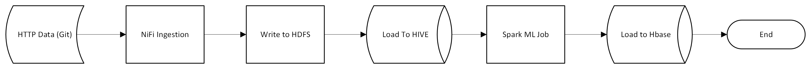

### Nifi Flow
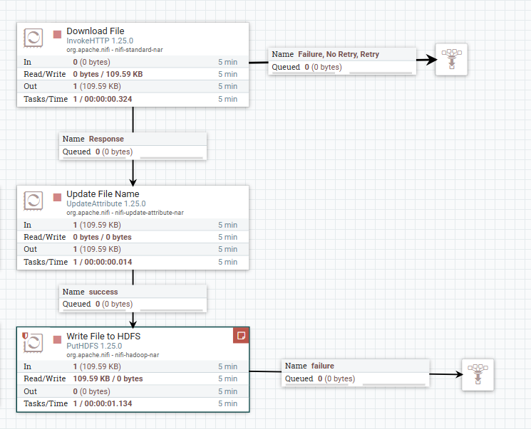

### Verify HDFS File
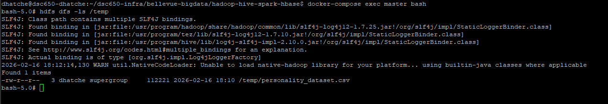

### Hive Table
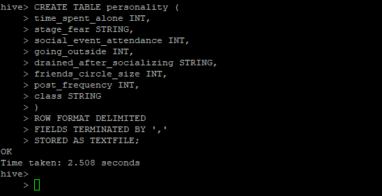  

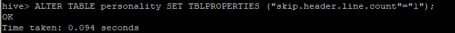

### Verify Hive Table
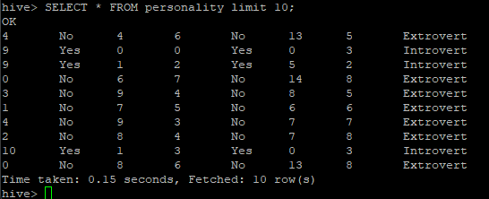

### Prepare environment for Spark Job  
Install packages on the Main Node
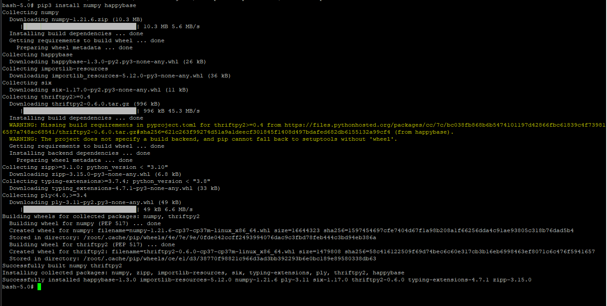  

Install packages on Worker1 Node
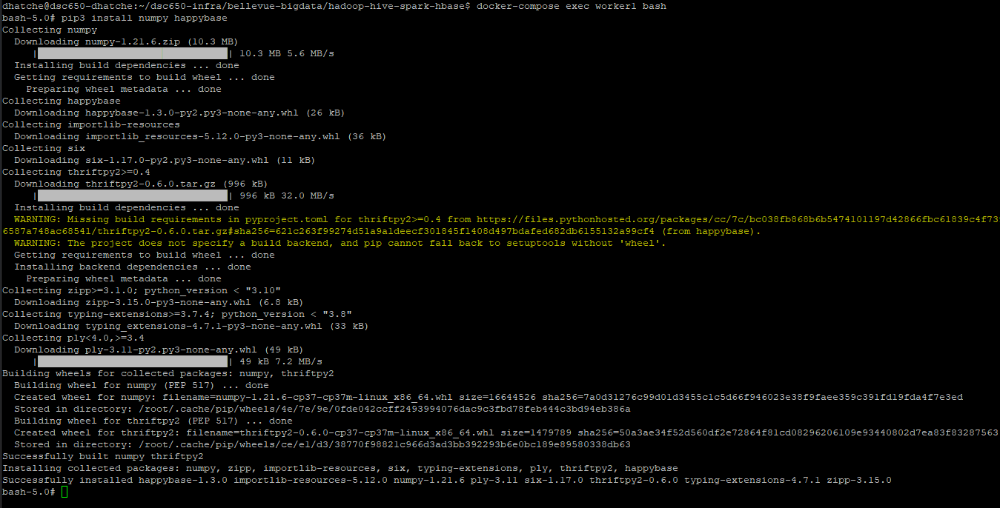  

Install packages on Worker2 Node
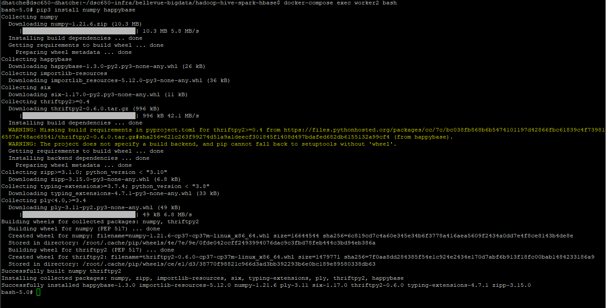  

Start the Thrift Server
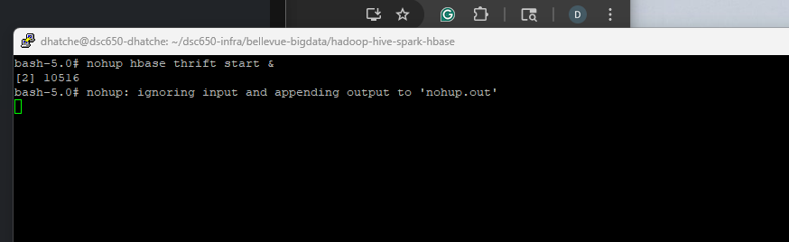  

### Create Hbase Table
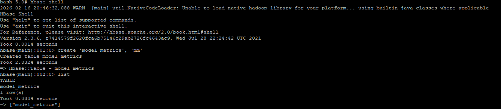  

### Run Spark Job
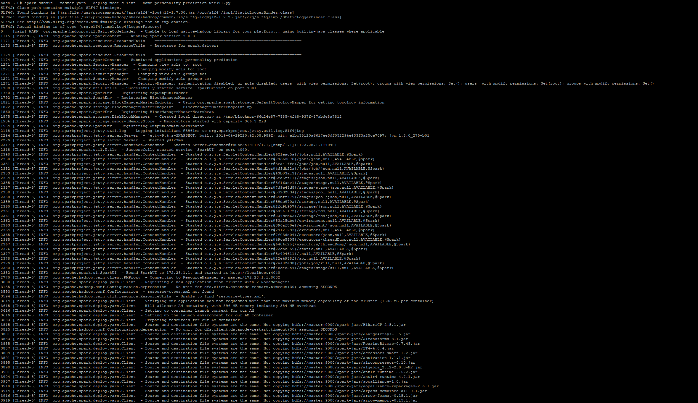  

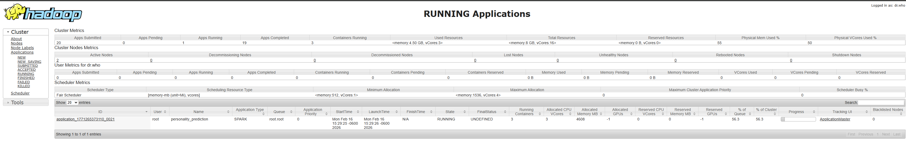  

### Verify Spark Job
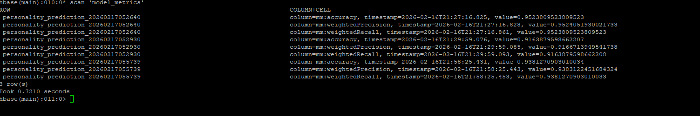  
